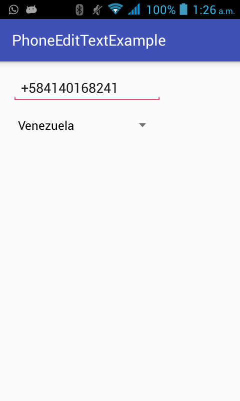

PhoneEditText [](https://jitpack.io/#leoxnidas/PhoneEditText)
-------------
special phoneedittext library that allows you to have internationals phone codes in a simple edittext, all international phone codes came from [https://countrycode.org/](https://countrycode.org/)


Usage
-----
1- first of all, add gradle dependencie
```gradle

allprojects {
    repositories {
        jcenter()
        maven { url "https://jitpack.io" }
    }
}
        .
        .
        .


dependencies {
    compile 'com.github.leoxnidas:PhoneEditText:1.1'
}
```

2- add PhoneEditText to your layout
```xml
<com.github.leoxnidas.phoneedittext.PhoneEditText
        app:code="USA"
        android:layout_width="200dp"
        android:layout_height="wrap_content"/>
```

3- enjoy =P




License
--------

